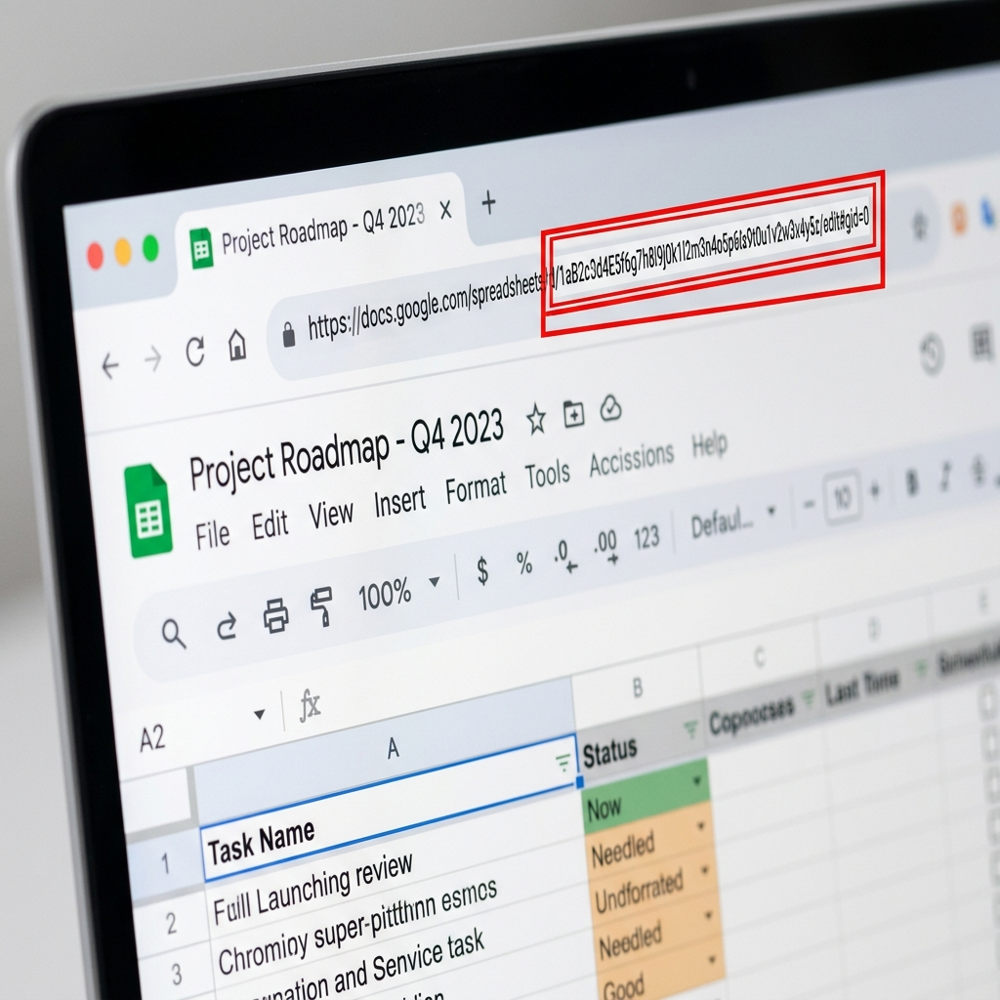

# Documentación de AppScript.js

El script `AppScript.js` es una automatización diseñada para gestionar los niveles de tóner de impresoras leyendo reportes enviados por correo electrónico y actualizando una hoja de cálculo (Google Sheets) que funciona como bitácora.

## Análisis de Funciones

### `CONFIG` (Objeto de Configuración)
Almacena todas las variables importantes que el script necesita para funcionar, como los IDs de las carpetas de Google Drive, los IDs de las hojas de cálculo, el correo para enviar alertas, los umbrales de nivel de tóner para cambiar colores o enviar alertas, y los nombres de las hojas (regiones).

### `procesoCompletoDescargaYActualizacion()`
Es la **función principal o maestra** (programada con un activador de tiempo). Funciona como un director de orquesta:
* Primero llama a la función que descarga los correos.
* Si detecta que se descargaron archivos nuevos, entonces llama a la función que actualiza la bitácora.
* Si no hay nada nuevo, simplemente termina y no hace trabajo innecesario.

### `guardarAdjuntosCSV()`
Se encarga de la extracción de datos:
* Busca en la bandeja de entrada de Gmail correos que vengan de `hp-sds-latam@insightportal.net` y que tengan archivos adjuntos.
* Ignora los correos que ya están marcados con estrella (para no procesar el mismo archivo dos veces).
* Si encuentra archivos `.csv`, los guarda en una carpeta específica de Google Drive y les cambia el nombre agregándoles la fecha y hora.
* Al finalizar, marca el correo con una estrella para saber que ya fue procesado. Devuelve `true` si guardó algo nuevo, o `false` si no hubo correos nuevos.

### `ejecutarProcesoToner()`
Es el motor de actualización de datos. Hace lo siguiente:
* Abre la Bitácora Principal de Google Sheets y la hoja de Auditoría.
* Lee los datos del último archivo CSV que se guardó en Drive.
* Recorre una por una las hojas de las distintas regiones (`CENTRAL`, `MANAGUA`, etc.).
* Por cada impresora en la hoja, busca si hay información nueva en el CSV (usando el número de serie y SKU como llave).
* **Lógica de negocio:**
  * Envía una alerta crítica por correo si el nivel de tóner cayó por debajo del 10%.
  * Actualiza el porcentaje de tóner en la celda correspondiente si este cambió.
  * Actualiza el Número de Serie (S/N) del tóner si detecta que es uno nuevo.
  * Colorea la fila de **Rojo** si el nivel está por debajo del umbral de peligro, o le quita el color si ya se recuperó el nivel (se cambió el tóner).
* Finalmente, guarda un historial de todos estos cambios en la hoja "Cambios_Consolidado".

---

## 🛠 Mini-Tutorial: Cómo obtener el ID de un Google Sheet

Para que el script funcione correctamente, necesitas indicarle los IDs exactos de tus hojas de cálculo en la configuración (`CONFIG`). 

El ID de un Google Sheet es una cadena larga de letras y números que se encuentra en la URL de tu navegador.

### Pasos para encontrar el ID:

1. Abre tu hoja de cálculo (por ejemplo, tu "Bitácora de Regiones") en el navegador.
2. Observa la barra de direcciones (URL) en la parte superior.
3. La URL tendrá un formato como este:
   `https://docs.google.com/spreadsheets/d/1abc123DEF456ghi789jkl/edit#gid=0`
4. El **ID de tu hoja de cálculo** es **únicamente** la parte que está entre `/d/` y `/edit`.
5. Cópialo y pégalo en tu código.



```javascript
// Ejemplo de cómo se ve en el código:
const CONFIG = {
    // ...
    ID_BITACORA_PRINCIPAL: "1abc123DEF456ghi789jkl", // ¡Pega tu ID aquí!
    // ...
};
```
